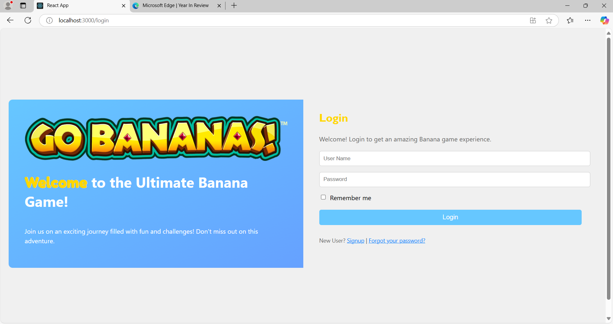
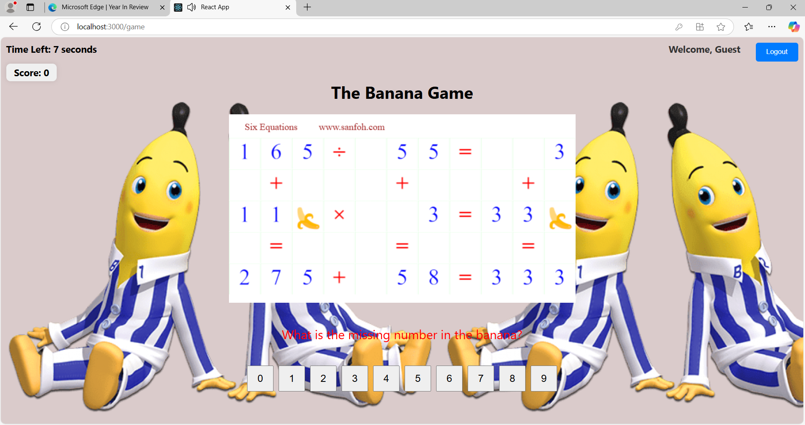

# Banana Math Game (React Version)
An enhanced web-based math game built with **React**, based on a case study for the "Distributed Service Architectures" module. This version goes beyond the original brief by implementing full **user authentication**, a **scoreboard**, **sound effect**, and a more modern, interactive UI.

## 📌 Features

- 📝 **Register/Login Pages** with validation
- 📊 **Scoreboard** to track high scores
- 🎧 **Sound effects** for feedback and gameplay immersion
- 🎨 **Responsive Design** using modern React practices
- ⚛️ Fully componentized and easy to extend
- ⌛ Game timer
- 👍 Game feedback popup

---

## 🛠️ Tech Stack

- **Frontend**: React, JavaScript (ES6+), HTML5, CSS3
- **Routing**: React Router
- **State Management**: useState, useEffect, Redux 
- **Audio**: HTML5 Audio API or JavaScript-based sound libraries
- **Backend**: MongoDB

## 📸 Screenshots

### 🔐 Login Page

## Running the project locally

1. Navigate to the backend folder & copy the folder as path
In your cmd, 
## install dependencies and run backend

cd backend
npm install
npm start

## running the frontend (React)

open a new terminal, go to frontend folder and copy as path

cd frontend

## run the app:
npm install
npm start 

## make sure the backend runs on port 3001. adjust if needed
